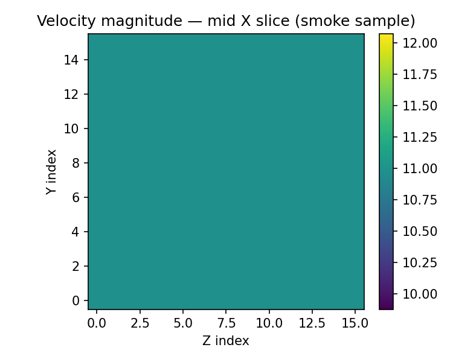
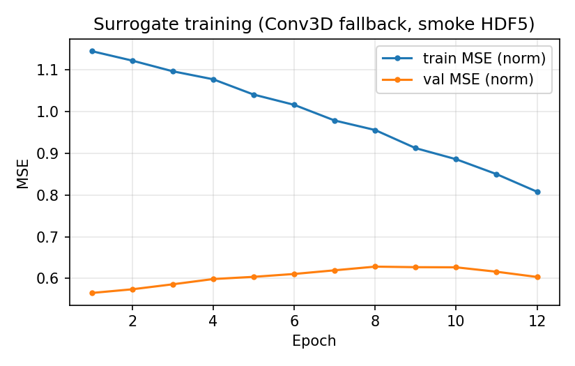
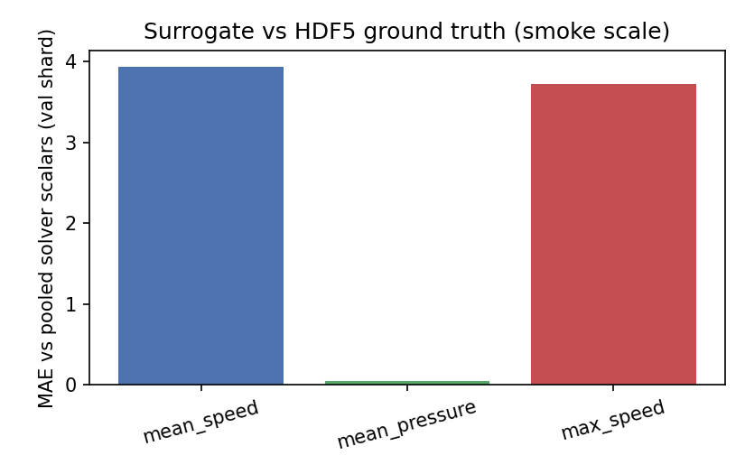
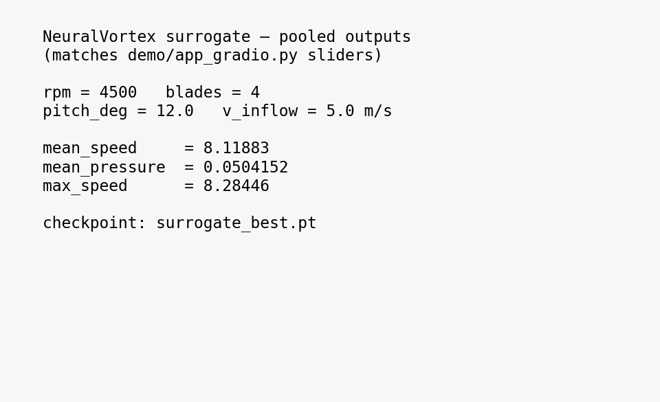
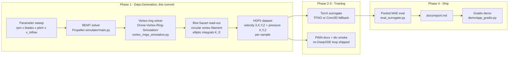

# NeuralVortex

**ML-accelerated surrogate for drone-propeller vortex CFD.** The numerical solvers are slow; a Fourier Neural Operator trained on their output is targeted to be roughly two orders of magnitude faster while preserving the physics. Built on the author's own CFD simulators ([`Drone-Vortex-Ring-Simulation`](https://github.com/Siddarthb07/Drone-Vortex-Ring-Simulation), [`Propeller-simulator`](https://github.com/Siddarthb07/Propeller-simulator)).

## Status

| Phase | Scope | Status |
|---|---|---|
| 1 | Data pipeline + repo scaffold | DONE |
| 2 | Torch surrogate (`train_tfno.py`, optional `neuralop` TFNO + W&B) | DONE (smoke-scale default; scale data for real accuracy) |
| 3 | PINN stretch | Documented + divergence smoke (`train/pinn_residual_smoke.py`) — no DeepXDE loop shipped |
| 4 | Report + Gradio | `docs/report.md` + phased dashboard `demo/app_gradio.py`; narrative [`docs/DEEP_DIVE.md`](docs/DEEP_DIVE.md); HF outline in `demo/README.md` |

Smoke HDF5 trains in minutes on CPU using the Conv3D fallback (`--no-tfno`). Large LHS sweeps remain the path to meaningful generalization metrics.

## Demo gallery

Regenerate assets anytime — see [`docs/DEMO.md`](docs/DEMO.md) (`scripts/capture_demo_assets.py`, `scripts/plot_inference_panel.py`).

| Velocity slice | Training loss | Pooled MAE | Inference panel |
|:---:|:---:|:---:|:---:|
|  |  |  |  |

## What's in the box

- Phase **1:** unified solver API (`data/solvers.py`), HDF5 sweeps (`data/generate.py`), smoke tests, explorer notebook.
- Phase **2:** torch surrogate training (`train/train_tfno.py`) with optional TFNO (`neuralop`) or Conv3D fallback; optional W&B.
- Phase **3:** PINN scope notes (`docs/pinn_notes.md`) + divergence smoke (`train/pinn_residual_smoke.py`).
- Phase **4:** Markdown report (`docs/report.md`) + phased Gradio dashboard (`demo/app_gradio.py`) + [`docs/DEEP_DIVE.md`](docs/DEEP_DIVE.md).

## Architecture



## Quick start

```bash
python -m venv .venv
source .venv/bin/activate    # or: .venv\Scripts\activate on Windows
pip install -r requirements.txt
bash scripts/smoke_test.sh   # writes data/smoke.h5
pytest tests/                # solver + surrogate smoke (needs torch for surrogate test)
```

### Phases 2–4 (short path)

```bash
pip install -r requirements-train.txt
python train/train_tfno.py --no-tfno --epochs 40 --cpu-only --h5 data/smoke.h5
python train/eval_surrogate.py --no-tfno --cpu-only
python train/pinn_residual_smoke.py --h5 data/smoke.h5
pip install -r requirements-demo.txt
python demo/app_gradio.py
```

See `train/README.md` and `docs/report.md`.

The smoke test produces `data/smoke.h5` with 4 samples, each holding a `(3, 16, 16, 16)` velocity field and a `(16, 16, 16)` pressure field plus the BEMT thrust/torque/efficiency for the same input parameters.

## How the physics is wired up

The two parent simulators are imported intact. `data/solvers.py` is documented line-by-line with which formulas and constants are taken verbatim from which file:

- Kelvin-type circulation scaling `Gamma ~ sqrt(T * 4*pi*R / rho)` - from `vortex_rings_simulation.py:L44-L50`.
- Helmholtz thin-ring self-induction `U = Gamma/(4 pi R) * (ln(8R/a) - 1/4)` - from `vortex_rings_simulation.py:L89`.
- Viscous core decay `Gamma *= exp(-nu dt/a^2)` - from `vortex_rings_simulation.py:L84`.
- BEMT integration loop, `cl/cd` model, tip-Mach helper - from `Propeller-simulator/main.py:L37-L115`.

The only new physics is a textbook Biot-Savart sampler that turns each `VortexRingSimple` object into a velocity field on the requested 3D grid (standard elliptic-integral expression; references in `solvers.py` header). Pressure is recovered from the incompressible Bernoulli relation. Neither read-out modifies the parent solvers.

## Reading list

- Li et al., 2020 — *Fourier Neural Operator for Parametric Partial Differential Equations* (ICLR 2021). [arXiv:2010.08895](https://arxiv.org/abs/2010.08895)
- Raissi, Perdikaris, Karniadakis, 2019 — *Physics-informed neural networks*. [J. Comp. Phys.](https://www.sciencedirect.com/science/article/pii/S0021999118307125)
- Kovachki et al., 2023 — *Neural Operator: Learning Maps Between Function Spaces*. [arXiv:2108.08481](https://arxiv.org/abs/2108.08481)
- Karniadakis et al., 2021 — *Physics-informed machine learning* (Nature Reviews Physics). [link](https://www.nature.com/articles/s42254-021-00314-5)

## Parent simulators

- [`Siddarthb07/Drone-Vortex-Ring-Simulation`](https://github.com/Siddarthb07/Drone-Vortex-Ring-Simulation) — reduced-order CFD simulator for drone-propeller vortex rings (Kelvin circulation scaling, Helmholtz self-induction, viscous core decay, interactive matplotlib GUI).
- [`Siddarthb07/Propeller-simulator`](https://github.com/Siddarthb07/Propeller-simulator) — BEMT-based propeller performance simulator with Tkinter GUI, CLI mode, and CSV logging.

## Honest limits

- The vortex-ring evolution is reduced-order (discrete circular rings with Helmholtz self-induction + viscous decay), not a full Navier-Stokes solve. The dataset is meaningful as a training target for an operator-learning baseline, not as a CFD ground truth at the level of OpenFOAM / Nek5000.
- The BEMT model is the parent simulator's `simple_bemt` (uniform inflow, thin-airfoil `cl/cd`). Glauert induction iteration and Prandtl tip losses are deferred to a future revision, matching the parent repo's `full_bemt` TODO.
- Smoke-trained surrogates prove the training loop; wall-clock speedups vs the generator require profiling on your hardware and a deployed checkpoint.

## Citation

```bibtex
@misc{boggarapu2026neuralvortex,
  author       = {Siddarth Boggarapu},
  title        = {NeuralVortex: ML-accelerated surrogate for drone-propeller vortex CFD},
  year         = {2026},
  howpublished = {\url{https://github.com/Siddarthb07/NeuralVortex}},
  note         = {Phases 1–4: data generation, torch surrogate smoke pipeline, Gradio demo.}
}
```

## License

[MIT](./LICENSE).
