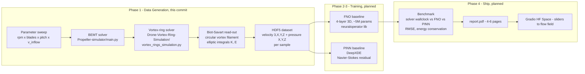

# NeuralVortex

**ML-accelerated surrogate for drone-propeller vortex CFD.** The numerical solvers are slow; a Fourier Neural Operator trained on their output is targeted to be roughly two orders of magnitude faster while preserving the physics. Built on the author's own CFD simulators ([`Drone-Vortex-Ring-Simulation`](https://github.com/Siddarthb07/Drone-Vortex-Ring-Simulation), [`Propeller-simulator`](https://github.com/Siddarthb07/Propeller-simulator)).

## Status

| Phase | Scope | Status |
|---|---|---|
| 1 | Data pipeline + repo scaffold | DONE |
| 2 | FNO training (`neuraloperator`, W&B logging) | IN PROGRESS |
| 3 | PINN baseline (`DeepXDE`, Navier-Stokes residual loss) | PLANNED (stretch) |
| 4 | `report.pdf` + Gradio HF Space demo | PLANNED |

There are no learned-surrogate results yet. Phase 1 only proves the dataset can be regenerated end-to-end from the parent simulators on a single machine.

## What's in the box (Phase 1)

- A unified, headless solver API around the two parent simulators (`data/solvers.py`).
- A CLI that sweeps the four-parameter input space `(rpm, blades, pitch, v_inflow)` and writes a single HDF5 (`data/generate.py`).
- A smoke test that generates 4 samples on a 16-cube grid in well under 2 minutes (`scripts/smoke_test.sh`).
- A pytest suite that exercises the solver API on a tiny grid.
- A notebook that loads the HDF5 and plots a velocity and pressure slice (`notebooks/01_explore_dataset.ipynb`).

## Architecture



## Quick start

```bash
python -m venv .venv
source .venv/bin/activate    # or: .venv\Scripts\activate on Windows
pip install -r requirements.txt
bash scripts/smoke_test.sh   # writes data/smoke.h5
pytest tests/                # runs the solver smoke suite
```

The smoke test produces `data/smoke.h5` with 4 samples, each holding a `(3, 16, 16, 16)` velocity field and a `(16, 16, 16)` pressure field plus the BEMT thrust/torque/efficiency for the same input parameters.

## How the physics is wired up

The two parent simulators are imported intact. `data/solvers.py` is documented line-by-line with which formulas and constants are taken verbatim from which file:

- Kelvin-type circulation scaling `Gamma ~ sqrt(T * 4*pi*R / rho)` - from `vortex_rings_simulation.py:L44-L50`.
- Helmholtz thin-ring self-induction `U = Gamma/(4 pi R) * (ln(8R/a) - 1/4)` - from `vortex_rings_simulation.py:L89`.
- Viscous core decay `Gamma *= exp(-nu dt/a^2)` - from `vortex_rings_simulation.py:L84`.
- BEMT integration loop, `cl/cd` model, tip-Mach helper - from `Propeller-simulator/main.py:L37-L115`.

The only new physics is a textbook Biot-Savart sampler that turns each `VortexRingSimple` object into a velocity field on the requested 3D grid (standard elliptic-integral expression; references in `solvers.py` header). Pressure is recovered from the incompressible Bernoulli relation. Neither read-out modifies the parent solvers.

## Reading list

- Li et al., 2020 — *Fourier Neural Operator for Parametric Partial Differential Equations* (ICLR 2021). [arXiv:2010.08895](https://arxiv.org/abs/2010.08895)
- Raissi, Perdikaris, Karniadakis, 2019 — *Physics-informed neural networks*. [J. Comp. Phys.](https://www.sciencedirect.com/science/article/pii/S0021999118307125)
- Kovachki et al., 2023 — *Neural Operator: Learning Maps Between Function Spaces*. [arXiv:2108.08481](https://arxiv.org/abs/2108.08481)
- Karniadakis et al., 2021 — *Physics-informed machine learning* (Nature Reviews Physics). [link](https://www.nature.com/articles/s42254-021-00314-5)

## Parent simulators

- [`Siddarthb07/Drone-Vortex-Ring-Simulation`](https://github.com/Siddarthb07/Drone-Vortex-Ring-Simulation) — reduced-order CFD simulator for drone-propeller vortex rings (Kelvin circulation scaling, Helmholtz self-induction, viscous core decay, interactive matplotlib GUI).
- [`Siddarthb07/Propeller-simulator`](https://github.com/Siddarthb07/Propeller-simulator) — BEMT-based propeller performance simulator with Tkinter GUI, CLI mode, and CSV logging.

## Honest limits

- The vortex-ring evolution is reduced-order (discrete circular rings with Helmholtz self-induction + viscous decay), not a full Navier-Stokes solve. The dataset is meaningful as a training target for an operator-learning baseline, not as a CFD ground truth at the level of OpenFOAM / Nek5000.
- The BEMT model is the parent simulator's `simple_bemt` (uniform inflow, thin-airfoil `cl/cd`). Glauert induction iteration and Prandtl tip losses are deferred to a future revision, matching the parent repo's `full_bemt` TODO.
- No models have been trained yet. The "100x speedup" framing is the goal of Phase 2, not a measured result.

## Citation

```bibtex
@misc{boggarapu2026neuralvortex,
  author       = {Siddarth Boggarapu},
  title        = {NeuralVortex: ML-accelerated surrogate for drone-propeller vortex CFD},
  year         = {2026},
  howpublished = {\url{https://github.com/Siddarthb07/NeuralVortex}},
  note         = {Phase 1: data-generation pipeline.}
}
```

## License

[MIT](./LICENSE).
